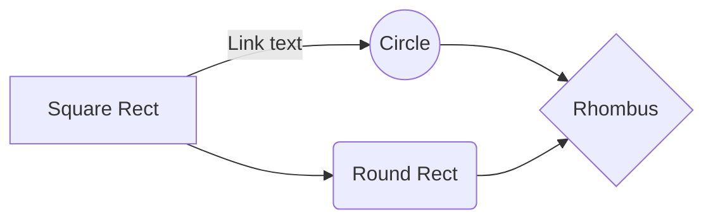

This is my 4-! yes it is bro

$a^2 + b^2 = c^2$

$$

\left( \sum*{k=1}^n a_k b_k \right)^2 \leq \left( \sum*{k=1}^n a*k^2 \right) \left( \sum*{k=1}^n b_k^2 \right)

$$

```mermaid
graph LR
    A[Square Rect] -- Link text --> B((Circle))
    A --> C(Round Rect)
    B --> D{Rhombus}
    C --> D
```
